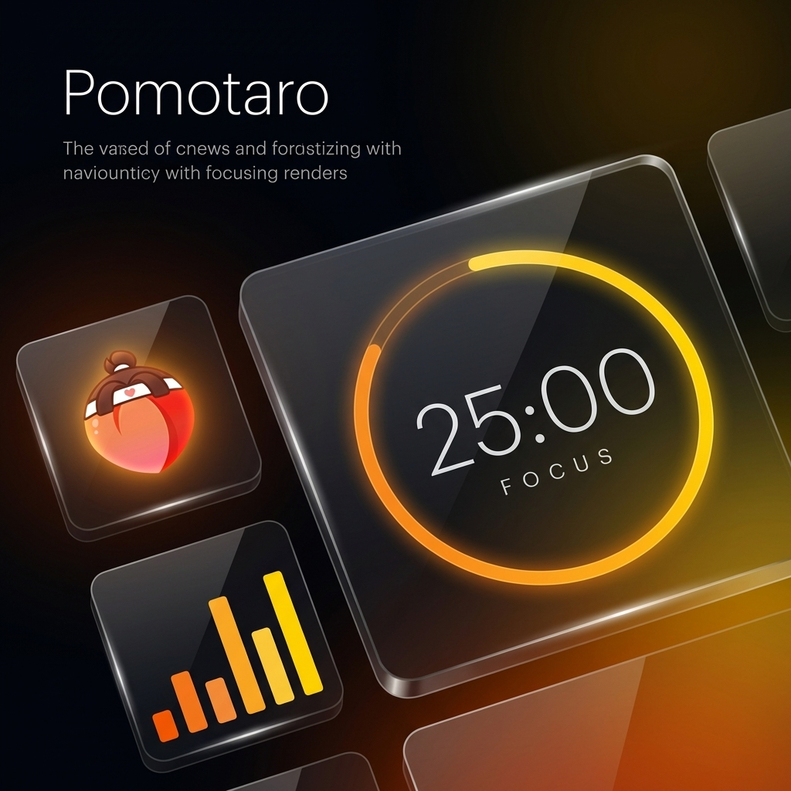

# Pomotaro 🍑



<div align="center">

[](https://github.com/Hum1Tab/Pomotaro-Desktop/releases/latest)
[](LICENSE)


**[English Version](./README.md)**

</div>

---

### あなたの集中力を極限まで高める、最強のお供。

**Pomotaro（ポモタロウ）** は、単なるタイマーではありません。「1秒の狂いもない正確さ」と「中断しても再開できる安心感」を備え、あなたの集中（鬼退治）を強力にサポートする、現代のワークフローのための最高のパートナーです。

## ✨ 強力な「お供」たち

### 🐕 忠実な「イヌ」：絶対的な精度
> *一瞬たりとも逃さない。*
- **タイムスタンプ駆動**: OSの処理負荷やラグに一切影響されず、実時間を正確に刻み続けます。
- **完全自動復旧**: アプリを誤って閉じても、PCがクラッシュしても大丈夫。再起動すれば、中断したその瞬間からタイマーが復活します。

### 🐒 賢い「サル」：繋がる集中
> *背中で語る。*
- **Discord Rich Presence連携**: あなたの現在のステータス（集中/休憩）、何セット目かをDiscordのプロフィールにリアルタイム同期。
- リモートワークや作業通話で、仲間と「集中のリズム」を共有できます。

### 🕊️ 鋭い「キジ」：常に寄り添う
> *視線を外さずに。*
- **ウィンドウタイトル通知**: アプリが画面の裏に隠れていても、ウィンドウタイトルで残り時間を確認可能。作業の手を止める必要はありません。

---

## 🛡️ 鉄壁のデータ保護

あなたの努力の証（ログ）を決して無駄にしません。
**デュアルレイヤー保存システム**を採用：

1.  **高速アクセス**: `localStorage` による瞬時の読み書き。
2.  **物理バックアップ**: `app-data.json` への物理ファイル保存。

たとえブラウザキャッシュがクリアされても、物理ファイルから自動的に履歴を復元します。

---

## 🎨 洗練された体験

- **Glassmorphism Design**: ダークテーマを基調とし、鮮やかなオレンジが映える美しいガラス風デザイン。
- **Zero-Latency Audio**: 集中力を高めるホワイトノイズ（White/Pink/Brown）と通知音をラグなしで再生。
- **Keyboard First**: マウスを使わず、矢印キーだけでセッションを切り替え可能。


---

## 🛠️ 技術スタック

<div align="center">


</div>

## 🚀 はじめ方

```bash
# 依存関係のインストール
pnpm install

# 開発モードで起動
pnpm dev

# 本番ビルド
pnpm build
```

## 📄 ライセンス

[MIT License](LICENSE)
