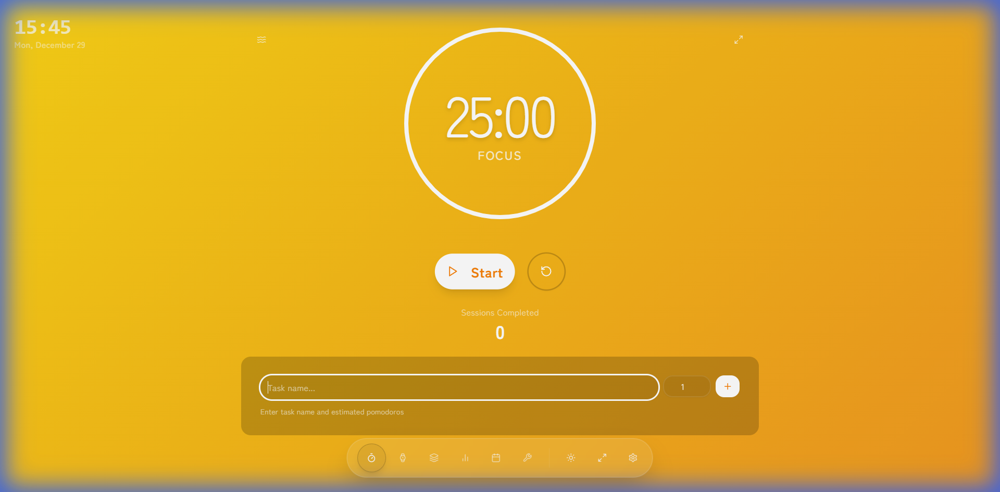
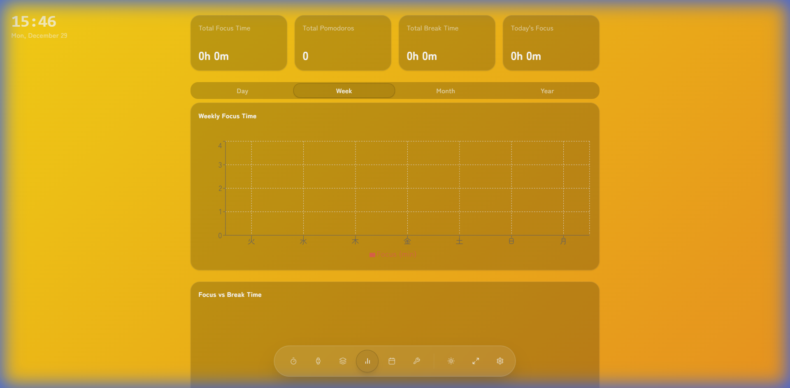
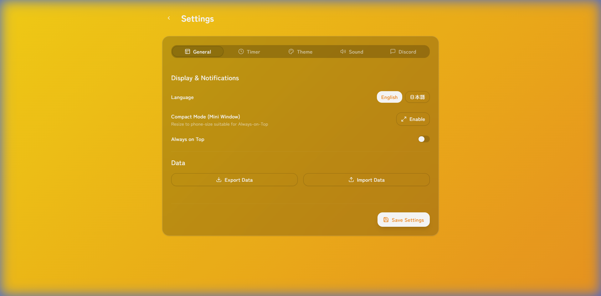

# Pomotaro 🍑 [日本語版](./README.ja.md)

Pomotaro is a modern, feature-rich Pomodoro timer application designed to be your best companion for productivity. Unlike simple timers, Pomotaro focuses on extreme precision and reliability, ensuring your hard-earned focus is never lost.



## ✨ Features

### 🚀 Powerful Companions
- **🐕 Faithful Dog: High-Precision Timer**
  - Uses timestamp-based logic for millisecond accuracy, unaffected by system load.
  - **State Persistence**: Automatically restores your timer exactly where you left off, even after an app restart or PC reboot.
- **🐒 Clever Monkey: Discord Rich Presence**
  - Syncs your focus status, current pomodoro count, and session type to Discord in real-time.
- **🕊️ Sharp Pheasant: Title Bar Progress**
  - Displays remaining time in the window title, allowing you to track progress while working in other apps.

### 🛡️ Ironclad Data Security
- **Hybrid Storage**: Simultaneously saves data to both `localStorage` and a physical file (`app-data.json`).
- **Auto-Recovery**: Automatically restores your history and tasks from the physical file if browser cache is cleared.
- **Full Backup**: Export and import your entire profile, including settings, tasks, and detailed session history.

### 🎨 Refined Experience
- **Zero-Latency Audio**: Pre-loaded white noise (White/Pink/Brown) and notification sounds for instant response.
- **Smart Accessibility**: Auto-focus on task inputs and arrow-key shortcuts for quick session switching.
- **Modern UI/UX**: Dark mode, smooth animations, and a sleek glassmorphism design.

### 📊 Visual Insights



## 🛠️ Tech Stack

- **Framework**: [React 19](https://react.dev/)
- **Runtime**: [Electron](https://www.electronjs.org/)
- **Build Tool**: [Vite](https://vitejs.dev/)
- **Styling**: [Tailwind CSS](https://tailwindcss.com/)
- **UI Components**: [Radix UI](https://www.radix-ui.com/), [Lucide React](https://lucide.dev/)
- **Animations**: [Framer Motion](https://www.framer.com/motion/)

## 🚀 Getting Started

1. **Install dependencies**:
   ```bash
   pnpm install
   ```

2. **Run in Development**:
   ```bash
   pnpm dev
   ```

3. **Build for Production**:
   ```bash
   pnpm build
   ```

## 📄 License

Distributed under the MIT License. See `LICENSE` for more information.
